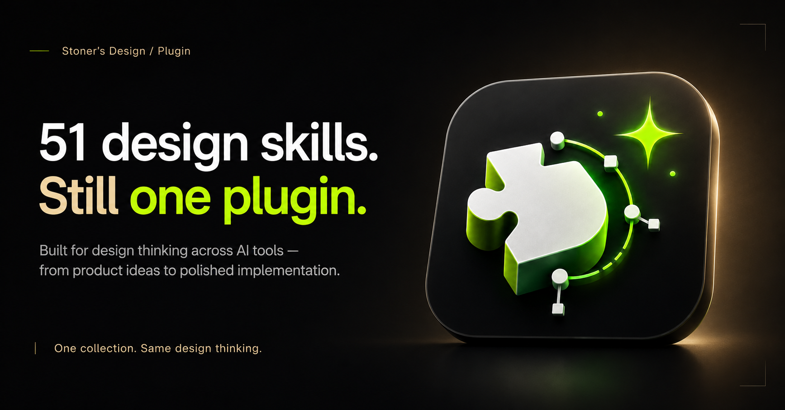

# Stoner's Design

51 design skills. One portable collection for product thinking, UX, visual design, Figma, frontend craft, motion, branding, and portfolio storytelling.

The repository combines the open `SKILL.md` format with native manifests for Codex, Claude Code, Gemini CLI, GitHub Copilot CLI, and compatible Cursor workflows. It also includes a dependency-free MCP server for any client that supports MCP over stdio.

## What it can do

- Shape product strategy, flows, edge cases, audits, and handoff
- Design or critique UI with stronger hierarchy, typography, spacing, interaction, and accessibility
- Work through Figma implementation and design-system tasks
- Build distinctive frontend experiences and translate images into code
- Create brand systems, logos, high-end visual direction, and motion
- Structure portfolio stories and product-design case studies

## Install

Replace `OWNER` with the published GitHub account in the commands below.

### Codex

```bash
codex plugin marketplace add OWNER/stoners-design
codex plugin install stoners-design@stoners-design-marketplace
```

### Claude Code

```bash
claude plugin marketplace add OWNER/stoners-design
claude plugin install stoners-design@stoners-design-marketplace
```

### Gemini CLI

```bash
gemini extensions install https://github.com/OWNER/stoners-design
```

### GitHub Copilot CLI

```bash
copilot plugin install OWNER/stoners-design
```

### Cursor and other Agent Skills clients

Use the repository's `skills/` directory as a skill source, or install individual skills into the client's supported skills directory. Cursor recognizes the same `SKILL.md` structure.

### Any MCP client

Clone the repository, then configure a stdio server:

```json
{
  "mcpServers": {
    "stoners-design": {
      "command": "node",
      "args": ["/absolute/path/to/stoners-design/mcp/server.mjs"]
    }
  }
}
```

The MCP exposes `list_design_skills`, `search_design_skills`, `get_design_skill`, and `get_design_skill_file`, plus one readable resource per skill.

## Requirements

- Node.js 18 or later for MCP
- The host AI tool's current plugin, extension, Agent Skills, or MCP support
- Any tool-specific dependencies named by an individual skill, such as Figma access or a frontend runtime

## Licensing

The original MCP server, manifests, packaging, and documentation are MIT licensed. Individual skills and bundled resources retain their own upstream terms. Review [THIRD_PARTY_NOTICES.md](THIRD_PARTY_NOTICES.md) before redistributing or modifying the collection.
